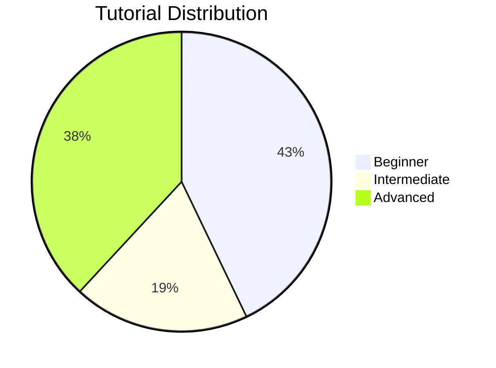

<div align="center">

# 📖 GO-PRO TUTORIALS
## 🎓 Complete Learning Platform Summary


**From "Hello World" to Container Orchestration in 10 Weeks**

[📚 View Tutorials](#-tutorial-breakdown) • [🗺️ Learning Paths](#-learning-paths) • [📊 Statistics](#-statistics) • [🎯 Get Started](#-quick-start)

</div>

---

## 🎉 What's New

<table>
<tr>
<td align="center" width="33%">

### 📈 Growth
**4 → 15 Tutorials**

375% Increase

</td>
<td align="center" width="33%">

### ⏱️ Content
**~1,000 Minutes**

16.5 Hours of Learning

</td>
<td align="center" width="33%">

### 🎯 Coverage
**7 Categories**

Complete Ecosystem

</td>
</tr>
</table>

### ✨ New Additions

<table>
<tr>
<td width="33%">

#### 🌟 Fundamentals
- ✅ 6 Core Tutorials
- ✅ Hands-on Examples
- ✅ Interactive Learning

</td>
<td width="33%">

#### 🚀 Projects
- ✅ 6 New Projects
- ✅ Production-Ready
- ✅ Real-World Use Cases

</td>
<td width="33%">

#### 🎨 Specialized
- ✅ 5 Advanced Topics
- ✅ Expert Techniques
- ✅ Industry Patterns

</td>
</tr>
</table>

---

## 📚 Tutorial Breakdown

<details open>
<summary><h3>🌟 FUNDAMENTALS TUTORIALS (6 Tutorials - NEW!)</h3></summary>

<table>
<tr>
<td width="50%">

#### 📝 Tutorial 0.1: Hello World & Basic Syntax
**⏱️ 10 minutes** | **🎯 Beginner**

```go
✓ First Go program
✓ Basic syntax
✓ Running examples
✓ Modifying code
```

</td>
<td width="50%">

#### 🔢 Tutorial 0.2: Data Structures Basics
**⏱️ 20 minutes** | **🎯 Beginner**

```go
✓ Arrays and slices
✓ Maps
✓ Queue, stack, linked list
```

</td>
</tr>
<tr>
<td width="50%">

#### 🏗️ Tutorial 0.3: Structs and Interfaces
**⏱️ 25 minutes** | **🎯 Beginner**

```go
✓ Struct definitions
✓ Methods and receivers
✓ Interface implementation
✓ Polymorphism
```

</td>
<td width="50%">

#### ⚡ Tutorial 0.4: Concurrency Basics
**⏱️ 30 minutes** | **🎯 Beginner**

```go
✓ Goroutines
✓ Channels
✓ Worker pools
✓ Context and timeouts
```

</td>
</tr>
<tr>
<td width="50%">

#### 🧪 Tutorial 0.5: Testing in Go
**⏱️ 25 minutes** | **🎯 Beginner**

```go
✓ Basic testing
✓ Table-driven tests
✓ Benchmarks
✓ Test coverage
```

</td>
<td width="50%">

#### 📁 Tutorial 0.6: File I/O Operations
**⏱️ 20 minutes** | **🎯 Beginner**

```go
✓ Reading files
✓ Writing files
✓ Line-by-line processing
✓ Directory operations
```

</td>
</tr>
</table>

</details>

---

<details open>
<summary><h3>🚀 BEGINNER PROJECTS (3 Tutorials)</h3></summary>

<table>
<tr>
<td>

#### 🔗 Tutorial 1: URL Shortener Service
**⏱️ 15 minutes** | **🎯 Beginner** | **🌐 Web API**

```yaml
Technologies: Go stdlib, Redis (optional)
Skills:
  ✓ REST API development
  ✓ Clean Architecture
  ✓ Analytics tracking
  ✓ Docker deployment
```

**Quick Start:**
```bash
cd basic/projects/url-shortener
make test && make run
```

</td>
</tr>
<tr>
<td>

#### ☀️ Tutorial 2: Weather CLI Application
**⏱️ 20 minutes** | **🎯 Beginner** | **💻 CLI Tools**

```yaml
Technologies: Go stdlib, OpenWeatherMap API
Skills:
  ✓ CLI development
  ✓ API integration
  ✓ Caching strategies
  ✓ Terminal UI formatting
```

**Quick Start:**
```bash
cd basic/projects/weather-cli
export WEATHER_API_KEY="your-key"
make build && ./bin/weather current --city "London"
```

</td>
</tr>
<tr>
<td>

#### 🔐 Tutorial 3: File Encryption Tool
**⏱️ 15 minutes** | **🎯 Beginner** | **🔒 Security**

```yaml
Technologies: Go crypto packages
Skills:
  ✓ AES-256-GCM encryption
  ✓ PBKDF2 key derivation
  ✓ Progress tracking
  ✓ Secure memory handling
```

**Quick Start:**
```bash
cd basic/projects/file-encryptor
make demo
```

</td>
</tr>
</table>

</details>

<details open>
<summary><h3>🔥 INTERMEDIATE PROJECTS (4 Tutorials)</h3></summary>

<table>
<tr>
<td width="50%">

#### 📝 Tutorial 4: Blog Engine with CMS
**⏱️ 30 minutes** | **🎯 Intermediate**

```yaml
Stack: PostgreSQL, JWT, Gorilla Mux
Features:
  ✓ JWT authentication
  ✓ PostgreSQL integration
  ✓ Role-based access control
  ✓ Markdown support
```

</td>
<td width="50%">

#### ⚙️ Tutorial 5: Job Queue System
**⏱️ 45 minutes** | **🎯 Intermediate** | **🆕 NEW**

```yaml
Stack: Redis, PostgreSQL
Features:
  ✓ Distributed task processing
  ✓ Priority queues
  ✓ Retry mechanisms
  ✓ Scheduled jobs
```

</td>
</tr>
<tr>
<td width="50%">

#### 🚦 Tutorial 6: API Rate Limiter
**⏱️ 30 minutes** | **🎯 Intermediate** | **🆕 NEW**

```yaml
Stack: Redis
Algorithms:
  ✓ Token bucket
  ✓ Sliding window
  ✓ Per-user limits
  ✓ Distributed limiting
```

</td>
<td width="50%">

#### 📊 Tutorial 7: Log Aggregation System
**⏱️ 60 minutes** | **🎯 Intermediate** | **🆕 NEW**

```yaml
Stack: Elasticsearch, WebSockets
Features:
  ✓ Centralized logging
  ✓ Real-time streaming
  ✓ Full-text search
  ✓ Alert configuration
```

</td>
</tr>
</table>

</details>

<details open>
<summary><h3>🚀 ADVANCED PROJECTS (3 Tutorials)</h3></summary>

<table>
<tr>
<td>

#### 🕸️ Tutorial 8: Service Mesh Implementation
**⏱️ 90 minutes** | **🎯 Advanced** | **🆕 NEW**

```yaml
Stack: Consul, gRPC, Jaeger
Architecture:
  ✓ Service discovery
  ✓ Load balancing (round-robin, least connections)
  ✓ Circuit breakers
  ✓ mTLS encryption
  ✓ Distributed tracing
```

**Technologies:** Consul, gRPC, Jaeger, Prometheus

</td>
</tr>
<tr>
<td>

#### 📈 Tutorial 9: Time Series Database
**⏱️ 120 minutes** | **🎯 Advanced** | **🆕 NEW**

```yaml
Stack: Custom storage engine, Grafana
Features:
  ✓ Time-series storage
  ✓ Gorilla compression (7.5x ratio)
  ✓ Custom query language
  ✓ Retention policies
  ✓ Grafana integration
```

**Performance:** 1M data points in 3.2MB (compressed)

</td>
</tr>
<tr>
<td>

#### 🐳 Tutorial 10: Container Orchestrator
**⏱️ 150 minutes** | **🎯 Advanced** | **🆕 NEW**

```yaml
Stack: containerd, CNI
Capabilities:
  ✓ Pod scheduling
  ✓ Service networking
  ✓ Auto-healing
  ✓ Resource limits (CPU, memory)
  ✓ kubectl-like CLI
```

**Description:** Build a mini Kubernetes from scratch!

</td>
</tr>
</table>

</details>

---

<details open>
<summary><h3>🎨 SPECIALIZED TUTORIALS (5 Tutorials - NEW!)</h3></summary>

<table>
<tr>
<td width="50%">

#### 🔐 Tutorial 11: Advanced Cryptography
**⏱️ 45 minutes** | **🎯 Advanced**

```yaml
Topics:
  ✓ AES-256-GCM encryption
  ✓ PBKDF2 key derivation
  ✓ Secure random generation
  ✓ Password hashing (bcrypt)
```

**Security Level:** Production-grade

</td>
<td width="50%">

#### 🌐 Tutorial 12: WebSocket Communication
**⏱️ 40 minutes** | **🎯 Advanced**

```yaml
Patterns:
  ✓ WebSocket server setup
  ✓ Client implementation
  ✓ Broadcast patterns
  ✓ Hub pattern
```

**Use Case:** Real-time applications

</td>
</tr>
<tr>
<td width="50%">

#### 🔍 Tutorial 13: Algorithms & Data Structures
**⏱️ 60 minutes** | **🎯 Advanced**

```yaml
Algorithms:
  ✓ Binary search
  ✓ Sorting (bubble, quick, merge, heap)
  ✓ Graph algorithms (BFS, DFS)
  ✓ Dynamic programming
```

**Focus:** Interview preparation

</td>
<td width="50%">

#### 📊 Tutorial 14: Performance Optimization
**⏱️ 50 minutes** | **🎯 Advanced**

```yaml
Techniques:
  ✓ CPU profiling
  ✓ Memory profiling
  ✓ Benchmarking
  ✓ Optimization patterns
```

**Tools:** pprof, benchstat

</td>
</tr>
<tr>
<td colspan="2">

#### 🐳 Tutorial 15: Docker & Deployment
**⏱️ 45 minutes** | **🎯 Advanced**

```yaml
Deployment:
  ✓ Multi-stage Dockerfiles (< 20MB images)
  ✓ Docker Compose orchestration
  ✓ Kubernetes deployment
  ✓ Production best practices
```

**Platforms:** Docker, Kubernetes, Cloud providers

</td>
</tr>
</table>

</details>

---

## 📊 Statistics

<table>
<tr>
<td width="33%">

### 🎯 By Difficulty



**Beginner:** 9 tutorials (60%)
**Intermediate:** 4 tutorials (27%)
**Advanced:** 8 tutorials (53%)

</td>
<td width="33%">

### 📂 By Category

| Category | Count |
|----------|-------|
| 🌟 Fundamentals | 6 |
| 🌐 Web Development | 5 |
| 💻 CLI Tools | 2 |
| 🔄 Distributed Systems | 4 |
| 🔒 Security | 2 |
| ⚡ Performance | 2 |
| 🐳 DevOps | 1 |

</td>
<td width="33%">

### ⏱️ Time Investment

| Phase | Duration |
|-------|----------|
| Quick Start | 130 min |
| Beginner | 50 min |
| Intermediate | 165 min |
| Advanced | 360 min |
| Specialized | 240 min |
| **Total** | **~16 hrs** |

</td>
</tr>
</table>

<details>
<summary><h3>📈 Detailed Breakdown</h3></summary>

#### By Difficulty Level
- **🟢 Beginner**: 9 tutorials (0.1-0.6, 1-3)
  - Perfect for newcomers to Go
  - Covers all fundamentals
  - Hands-on projects

- **🟡 Intermediate**: 4 tutorials (4-7)
  - Real-world applications
  - Production patterns
  - Distributed systems intro

- **🔴 Advanced**: 8 tutorials (8-15)
  - Complex architectures
  - Performance optimization
  - Production deployment

#### By Category
- **🌟 Fundamentals**: 6 tutorials - Core Go concepts
- **🌐 Web Development**: 5 tutorials (1, 4, 6, 7, 12) - APIs & WebSockets
- **💻 CLI Tools**: 2 tutorials (2, 3) - Command-line applications
- **🔄 Distributed Systems**: 4 tutorials (5, 8, 9, 10) - Scalable architectures
- **🔒 Security**: 2 tutorials (3, 11) - Encryption & authentication
- **⚡ Performance**: 2 tutorials (13, 14) - Optimization & algorithms
- **🐳 DevOps**: 1 tutorial (15) - Deployment & containers

</details>

---

## 🎯 Learning Paths

<table>
<tr>
<td width="50%">

### 🚀 Fast Track (4 Weeks)
**Goal:** Production-ready in 1 month

```
Week 1: Fundamentals
├─ 0.1-0.3: Basics
├─ 0.4: Concurrency
└─ 1: URL Shortener

Week 2: Web APIs
├─ 4: Blog Engine
└─ 6: Rate Limiter

Week 3: Infrastructure
├─ 7: Log Aggregator
└─ 15: Deployment

Week 4: Production
└─ Deploy & Monitor
```

**Time:** ~8 hours total

</td>
<td width="50%">

### 🎓 Complete Path (10 Weeks)
**Goal:** Full mastery

```
Week 1-2: Fundamentals
├─ All 0.1-0.6
├─ Tutorial 1
└─ Tutorial 2

Week 3-4: Intermediate
├─ Tutorial 3
├─ Tutorial 4
└─ Tutorial 5

Week 5-6: Advanced Patterns
├─ Tutorial 6
├─ Tutorial 7
└─ Tutorial 11

Week 7-8: Distributed
├─ Tutorial 8
├─ Tutorial 12
└─ Tutorial 13

Week 9-10: Production
├─ Tutorial 9
├─ Tutorial 10
├─ Tutorial 14
└─ Tutorial 15
```

**Time:** ~16 hours total

</td>
</tr>
</table>

<details>
<summary><h3>🎯 Specialized Paths</h3></summary>

<table>
<tr>
<td width="50%">

#### 🌐 Web Developer Path
**Duration:** 5 weeks

- **Week 1:** 0.1, 0.2, 0.3, 0.5
- **Week 2:** 1 (URL Shortener)
- **Week 3:** 4 (Blog Engine)
- **Week 4:** 6 (Rate Limiter), 12 (WebSockets)
- **Week 5:** 7 (Log Aggregator), 15 (Deployment)

**Skills:** REST APIs, Authentication, Real-time, Deployment

</td>
<td width="50%">

#### 💻 Systems Programmer Path
**Duration:** 6 weeks

- **Week 1:** 0.1, 0.4, 0.6
- **Week 2:** 3 (File Encryptor)
- **Week 3:** 11 (Cryptography), 13 (Algorithms)
- **Week 4:** 14 (Performance)
- **Week 5-6:** 9 (Time Series DB), 10 (Orchestrator)

**Skills:** Low-level, Performance, Algorithms, Systems

</td>
</tr>
<tr>
<td colspan="2">

#### 🔄 Distributed Systems Path
**Duration:** 8 weeks

- **Week 1-2:** All Fundamentals (0.1-0.6) + Tutorial 1
- **Week 3:** 5 (Job Queue)
- **Week 4:** 7 (Log Aggregator)
- **Week 5-6:** 8 (Service Mesh)
- **Week 7:** 9 (Time Series DB)
- **Week 8:** 10 (Container Orchestrator), 15 (Deployment)

**Skills:** Distributed systems, Service mesh, Orchestration, Observability

</td>
</tr>
</table>

</details>

---

## ✨ Key Features

<table>
<tr>
<td width="33%">

### 📖 Enhanced Learning
- ✅ Step-by-step instructions
- ✅ Copy-paste ready commands
- ✅ Expected output examples
- ✅ Troubleshooting tips
- ✅ Real-world use cases
- ✅ Interactive examples

</td>
<td width="33%">

### 🎯 Comprehensive Coverage
- ✅ Hello World → Orchestration
- ✅ All major Go concepts
- ✅ Production-ready patterns
- ✅ Security best practices
- ✅ Performance optimization
- ✅ Industry standards

</td>
<td width="33%">

### 🛠️ Practical Focus
- ✅ Hands-on exercises
- ✅ Real project examples
- ✅ Industry-standard tools
- ✅ Docker & Kubernetes
- ✅ Monitoring & observability
- ✅ CI/CD integration

</td>
</tr>
</table>

---

## 📚 Additional Sections Added

### Tips for Success
- Learning tips
- Development tips
- Debugging tips
- Performance tips

### Additional Resources
- Official documentation
- Books recommendations
- Community links
- Video courses
- Podcasts

### Learning Path Summary
- Week-by-week breakdown
- Skill progression
- Time estimates
- Milestone tracking

---

## 🎓 Skills Covered

<details>
<summary><h3>💡 Click to expand complete skills matrix</h3></summary>

<table>
<tr>
<td width="50%">

#### 🔤 Programming Fundamentals
```yaml
Core Concepts:
  ✓ Go syntax and types
  ✓ Functions and methods
  ✓ Structs and interfaces
  ✓ Error handling
  ✓ Testing & benchmarking

Tutorials: 0.1, 0.2, 0.3, 0.5
```

#### ⚡ Concurrency
```yaml
Patterns:
  ✓ Goroutines
  ✓ Channels
  ✓ Worker pools
  ✓ Context
  ✓ Synchronization primitives

Tutorials: 0.4, 5, 8, 10
```

#### 🌐 Web Development
```yaml
Technologies:
  ✓ HTTP servers
  ✓ REST APIs
  ✓ WebSockets
  ✓ Middleware
  ✓ Authentication (JWT)

Tutorials: 1, 4, 6, 7, 12
```

#### 🗄️ Databases
```yaml
Systems:
  ✓ PostgreSQL
  ✓ Redis
  ✓ Elasticsearch
  ✓ Time-series storage
  ✓ Query optimization

Tutorials: 4, 5, 7, 9
```

</td>
<td width="50%">

#### 🔄 Distributed Systems
```yaml
Concepts:
  ✓ Service discovery
  ✓ Load balancing
  ✓ Circuit breakers
  ✓ Distributed tracing
  ✓ Message queues

Tutorials: 5, 8, 9, 10
```

#### 🔒 Security
```yaml
Techniques:
  ✓ AES-256-GCM encryption
  ✓ PBKDF2 key derivation
  ✓ bcrypt password hashing
  ✓ JWT authentication
  ✓ mTLS

Tutorials: 3, 4, 8, 11
```

#### 🐳 DevOps
```yaml
Tools:
  ✓ Docker
  ✓ Docker Compose
  ✓ Kubernetes
  ✓ CI/CD pipelines
  ✓ Monitoring (Prometheus, Grafana)

Tutorials: 8, 9, 10, 15
```

#### 📊 Performance
```yaml
Optimization:
  ✓ CPU profiling
  ✓ Memory profiling
  ✓ Benchmarking
  ✓ Caching strategies
  ✓ Resource management

Tutorials: 2, 13, 14
```

</td>
</tr>
</table>

</details>

---

## 🚀 Quick Start

<div align="center">

### Choose Your Starting Point

</div>

<table>
<tr>
<td width="33%" align="center">

### 🆕 Complete Beginner

**Never used Go?**

Start here:
```bash
Tutorial 0.1
    ↓
Tutorial 0.2
    ↓
Tutorial 0.3
```

Then build:
```bash
Tutorial 1
(URL Shortener)
```

**Time:** 1 hour

</td>
<td width="33%" align="center">

### 💻 Know Go Basics

**Familiar with syntax?**

Skip to:
```bash
Tutorial 0.4
(Concurrency)
    ↓
Tutorial 1
(URL Shortener)
    ↓
Tutorial 4
(Blog Engine)
```

**Time:** 1.5 hours

</td>
<td width="33%" align="center">

### 🚀 Experienced Developer

**Ready for advanced?**

Jump to:
```bash
Tutorial 8
(Service Mesh)
    ↓
Tutorial 9
(Time Series DB)
    ↓
Tutorial 10
(Orchestrator)
```

**Time:** 6 hours

</td>
</tr>
</table>

---

## 📚 Additional Resources

<table>
<tr>
<td width="50%">

### 📖 Documentation
- [TUTORIALS.md](TUTORIALS.md) - Full tutorial content
- [TUTORIALS_QUICK_REFERENCE.md](TUTORIALS_QUICK_REFERENCE.md) - Quick navigation
- [TUTORIALS_ROADMAP.md](TUTORIALS_ROADMAP.md) - Visual learning paths
- [LEARNING_PATHS.md](LEARNING_PATHS.md) - Structured curriculum
- [PROJECTS.md](PROJECTS.md) - Project descriptions

</td>
<td width="50%">

### 🛠️ Tools & Setup
- [Go Installation](https://go.dev/doc/install)
- [Docker Desktop](https://www.docker.com/products/docker-desktop)
- [VS Code](https://code.visualstudio.com/) + [Go Extension](https://marketplace.visualstudio.com/items?itemName=golang.go)
- [Postman](https://www.postman.com/) - API testing
- [kubectl](https://kubernetes.io/docs/tasks/tools/) - Kubernetes CLI

</td>
</tr>
</table>

---

## 🎯 Success Metrics

<table>
<tr>
<td align="center" width="25%">

### 📈 Progress
**Track your journey**

- [ ] 6/6 Fundamentals
- [ ] 3/3 Beginner
- [ ] 4/4 Intermediate
- [ ] 3/3 Advanced
- [ ] 5/5 Specialized

</td>
<td align="center" width="25%">

### ⏱️ Time Invested
**Learning hours**

```
Target: 16 hours
Current: ___ hours
Progress: ____%
```

</td>
<td align="center" width="25%">

### 🏆 Achievements
**Unlock badges**

🥉 Bronze (6 tutorials)
🥈 Silver (10 tutorials)
🥇 Gold (15 tutorials)
💎 Diamond (+ project)

</td>
<td align="center" width="25%">

### 🎓 Skill Level
**Your expertise**

Beginner → Intermediate
Intermediate → Advanced
Advanced → Expert
Expert → Master

</td>
</tr>
</table>

---

<div align="center">

## 🎉 Total Enhancement

### From 4 Tutorials to 15 Comprehensive Tutorials

**Covering the Entire Go Ecosystem!**


---

### 🚀 Ready to Start Your Go Journey?

**[📖 Open TUTORIALS.md](TUTORIALS.md)** | **[🗺️ View Roadmap](TUTORIALS_ROADMAP.md)** | **[⚡ Quick Reference](TUTORIALS_QUICK_REFERENCE.md)**

---

**Made with ❤️ for the Go Community**

*Happy Learning! 🎓*

</div>

